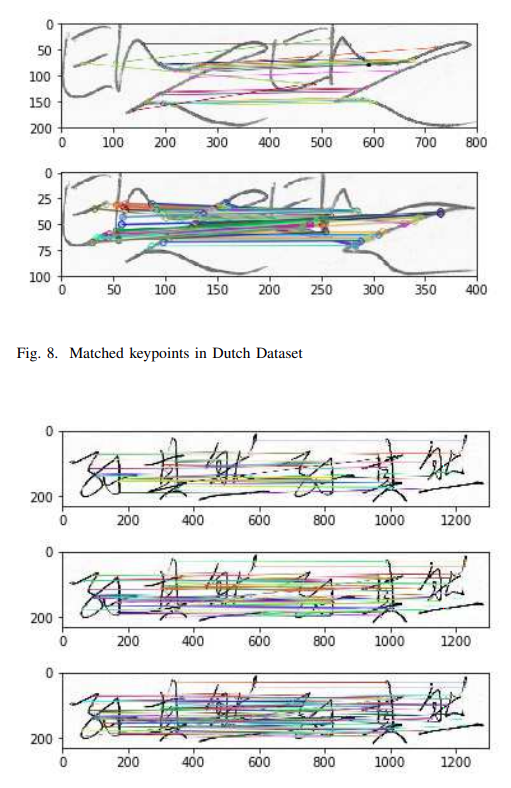

**Abstract:** Handwritten Signature is a widely used biometric in daily life as a mean of identity verification of an individual. For offline signature verification both accuracy and speed are important parameters. Accuracy may vary as the samples from signature datasets show a high intra-class variability. As these properties depend on the feature descriptor taken to represent the signature image, this selection is very important. In this study we provide a comparative performance evaluation of wellknown histogram based descriptors like SIFT and SURF and a wide variety of binary descriptors like BRIEF, ORB, BRISK and FREAK in the application of handwritten signature verification. We compare the performance of these feature descriptors against speed and accuracy. After the experimental analysis we have observed that binary features like ORB is faster with moderate accuracy but SIFT-like descriptors give better accuracy. Among them the combination of FAST feature detection and BRIEF descriptor is the fastest one but with lowest accuracy. 

**Keywords:** signature verification, feature detection, feature descriptors, SIFT, SURF, FAST, BRIEF, ORB, BRISK, FREAK

  

    
  

  

    
  

    

    
  

# Conclusions: 
From the performance evaluation we see that the performance metrics provide a trade-off between accuracy and time. Float features descriptors like SIFT and SURF give better accuracy but take longer time to finish the task. Binary descriptors are faster than their ancestors. BRIEF gives the fastest performance but lacks accuracy. ORB can be a quick one nearly catching the performance of histogram based ones. If the application needs real time action where accuracy is not the only concern, ORB can be a very good choice. But for an application where user can go for extra minutes for accuracy, float point descriptors are still the top choice. For banking application, lower false positive rate ensures that forged signatures is not considered as genuine. Thus money is not handed over to a fraud. Considering the performance in both the datasets, ORB
again tops the list.
The comparisons in this study give sufficient insight to investigate the choice of a good descriptor. It also shows the demand of feature descriptor which combines the performance both in accuracy and speed. For the future work, more descriptors can be put into test. For offline signature verification, some recently proposed methodologies like neural networks and deep learning will be added to the comparison. However, we believe that this comparison is sufficient to analyze the fastest and robust method.

